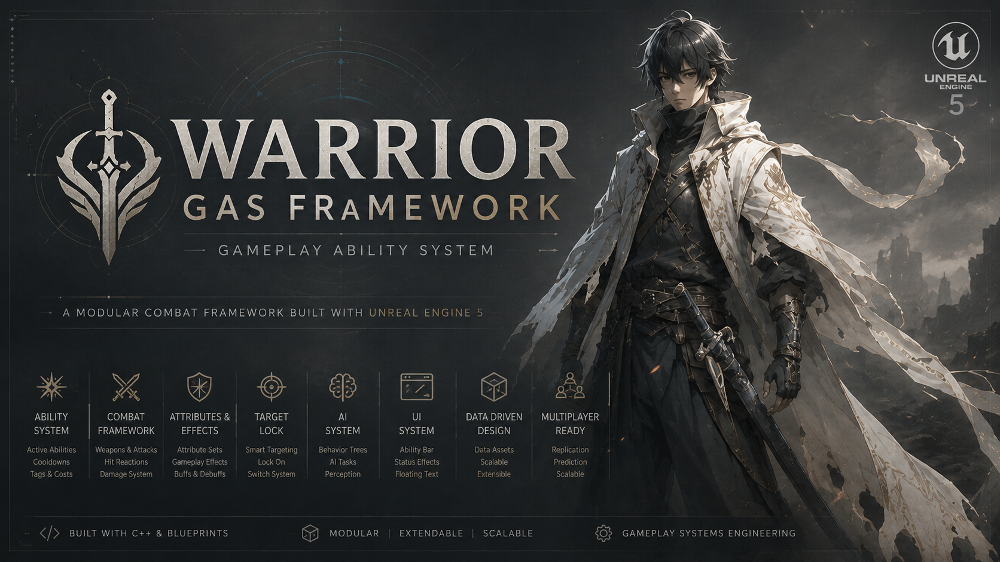
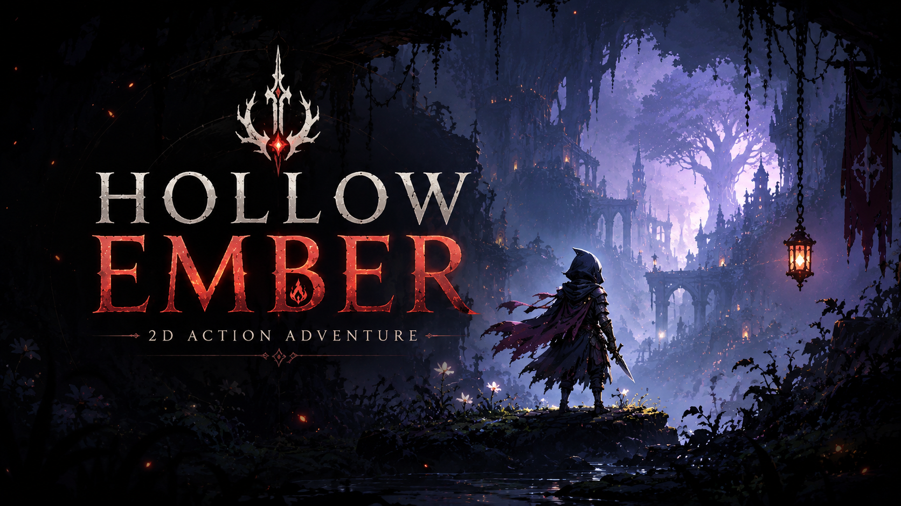
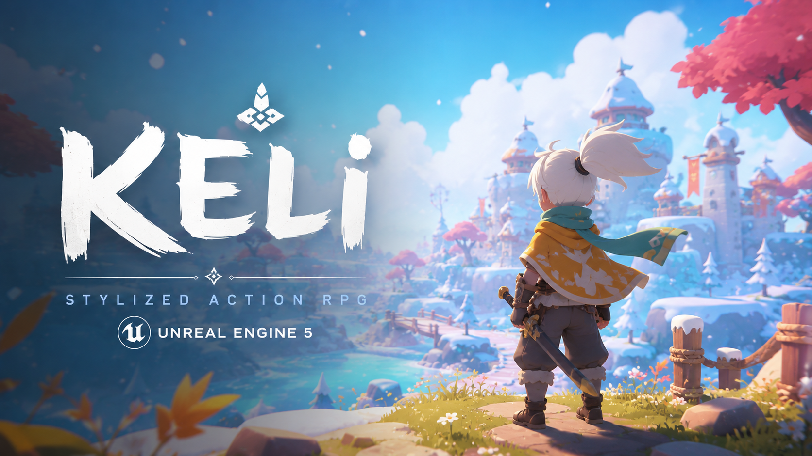

# Abdulmajeed Alshammari

### Gameplay Programmer | Unreal Engine Developer | Unity Developer

Building combat systems, gameplay frameworks, multiplayer experiences, AI behaviors, and scalable game architecture.

---

## About Me

I'm a Gameplay Programmer passionate about creating responsive gameplay experiences and production-oriented game systems using Unreal Engine and Unity.

My primary interests include:

- Gameplay Systems Engineering
- Combat Systems
- Gameplay Ability System (GAS)
- Multiplayer Gameplay
- AI Behaviors
- Character Controllers
- Action RPG & Souls-like Development

---

## Tech Stack

**Game Engines:** Unreal Engine 5, Unity

**Programming:** C++, C#, Object-Oriented Programming (OOP), SOLID Principles, Design Patterns

**Gameplay Systems:** Gameplay Ability System (GAS), Combat Systems, Character Controllers, AI Behaviors, State Machines, Gameplay Effects, Gameplay Tags

**Multiplayer:** Replication, RPCs, Host-Based Sessions, Netcode for GameObjects

**Tools:** Visual Studio, JetBrains Rider, Git, GitHub, Jira, Trello, Miro, Confluence

---

# Featured Projects

<table>
<tr>
<td width="50%" valign="top">

<h3>⭐ Warrior GAS Framework</h3>

Unreal Engine 5 Gameplay Ability System (GAS) combat framework focused on scalable gameplay architecture.

<b>Highlights</b>

- Gameplay Abilities
- Gameplay Effects
- Attribute System
- Combat Framework
- AI Systems
- Data-Driven Architecture

</td>

<td width="50%" valign="top">

<h3>🎮 Hollow Ember</h3>

2D Action Adventure prototype focused on exploration, combat, boss encounters, and progression systems.

<b>Highlights</b>

- Combat Systems
- Boss Encounters
- Ability Progression
- Exploration Gameplay
- NPC Interactions

</td>
</tr>

<tr>
<td width="50%" valign="top">

<h3>🌐 Project Blackout</h3>

Online multiplayer third-person shooter developed in Unreal Engine 5.

<b>Highlights</b>

- Multiplayer Networking
- Replication
- RPC Communication
- Host-Based Sessions
- Third-Person Combat

</td>

<td width="50%" valign="top">

<h3>⚔️ Keli</h3>

Stylized Action RPG prototype developed in Unreal Engine 5.

<b>Highlights</b>

- Combat Systems
- Foot IK
- Character Animation
- Stylized Art Direction
- Gameplay Feel Development

</td>
</tr>
</table>

---

## Areas of Interest

- Gameplay Programming
- Gameplay Systems Engineering
- Combat Systems
- Gameplay Ability System (GAS)
- Multiplayer Systems
- AI Programming
- Unreal Engine Development

---

## Current Focus

Currently expanding my expertise in:

- Advanced Gameplay Architecture
- Gameplay Ability System (GAS)
- Combat Framework Design
- Multiplayer Gameplay Systems
- AI Systems

---

## Connect With Me

📧 Email: [mjeedmsh@gmail.com](mailto:mjeedmsh@gmail.com)

💼 LinkedIn
https://www.linkedin.com/in/abdulmajeed-alshammari-a2a5a0328/

🐙 GitHub
https://github.com/MjeedDev
