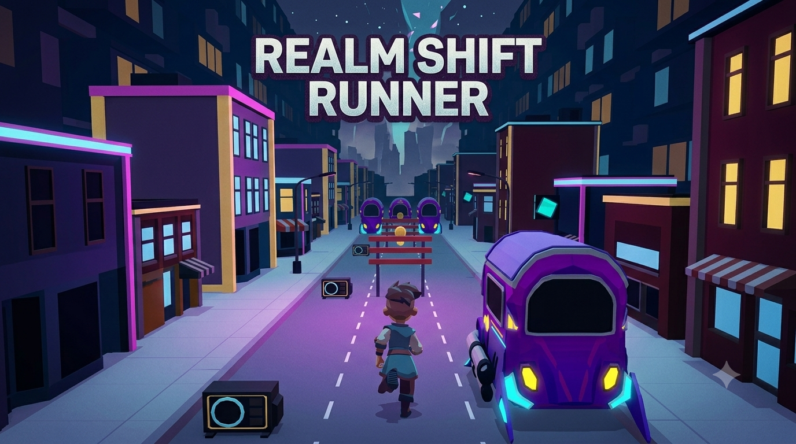
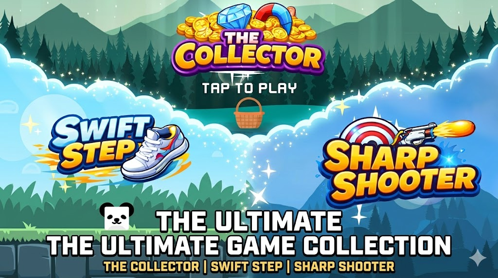

# Abdulmajeed Alshammari

### Gameplay Programmer | Unity • Unreal Engine • Technical Artist

Building polished gameplay systems, scalable architecture, game-ready prototypes, and technical art workflows with Unity and Unreal Engine.

---

## About Me

I'm a Gameplay Programmer passionate about building polished gameplay systems, clean architecture, and responsive player experiences using Unity and Unreal Engine.

Alongside programming, I create stylized game-ready environments and props in Blender, allowing me to prototype complete gameplay experiences from both technical and artistic perspectives.

---

## Tech Stack

### Game Development

- Unity
- Unreal Engine 5

### Programming

- C#
- C++
- OOP
- SOLID
- Design Patterns

### Gameplay

- Gameplay Systems
- Character Controllers
- State Machines
- Combat Systems
- AI Behaviors
- Gameplay Ability System (GAS)

### Multiplayer

- Netcode for GameObjects
- Replication
- RPCs

### 3D

- Blender
- Substance Painter
- Photoshop

### Tools

- Rider
- Visual Studio
- Git
- GitHub
- Jira

---

# Featured Projects

<table>
<tr>

<td width="50%" valign="top">

<h3>🌍 Realm Shift Runner</h3>

Unity 6 gameplay project featuring instant realm switching, responsive mobile controls, modular systems, object pooling, and scalable gameplay architecture.

<b>Highlights</b>

<ul>
<li>Unity 6 & C#</li>
<li>Mobile-First Controls</li>
<li>Real-Time Realm Switching</li>
<li>Modular Gameplay Architecture</li>
<li>Object Pooling</li>
<li>Progressive Difficulty</li>
<li>Polished Game Feel</li>
</ul>

</td>

<td width="50%" valign="top">

<h3>🕹️ Arcade Nexus</h3>

A collection of three Unity arcade games developed to demonstrate responsive controls, reusable gameplay systems, enemy behaviors, and varied gameplay mechanics.

<b>Highlights</b>

<ul>
<li>Unity & C#</li>
<li>Three Playable Games</li>
<li>Reusable Gameplay Systems</li>
<li>Responsive Controls</li>
<li>Enemy Behaviors</li>
<li>UI & Game Flow</li>
<li>Gameplay Polish</li>
</ul>

</td>

</tr>

<tr>

<td width="50%" valign="top">

<h3>⭐ Warrior GAS Framework</h3>

Unreal Engine 5 Gameplay Ability System combat framework focused on scalable, reusable, and data-driven gameplay architecture.

<b>Highlights</b>

<ul>
<li>Gameplay Abilities</li>
<li>Gameplay Effects</li>
<li>Attribute System</li>
<li>Combat Framework</li>
<li>AI Systems</li>
<li>Data-Driven Architecture</li>
</ul>

</td>

<td width="50%" valign="top">

<h3>🎮 Hollow Ember</h3>

A 2D action-adventure prototype focused on responsive combat, exploration, boss encounters, character abilities, and progression systems.

<b>Highlights</b>

<ul>
<li>Combat Systems</li>
<li>Boss Encounters</li>
<li>Ability Progression</li>
<li>Exploration Gameplay</li>
<li>NPC Interactions</li>
<li>Character Movement</li>
</ul>

</td>

</tr>

<tr>

<td width="50%" valign="top">

<h3>🌐 Project Blackout</h3>

An online multiplayer third-person shooter developed in Unreal Engine 5, featuring replicated combat and host-based multiplayer sessions.

<b>Highlights</b>

<ul>
<li>Multiplayer Networking</li>
<li>Replication</li>
<li>RPC Communication</li>
<li>Host-Based Sessions</li>
<li>Third-Person Combat</li>
<li>Networked Gameplay</li>
</ul>

</td>

<td width="50%" valign="top">

<h3>⚔️ Keli</h3>

A stylized action RPG prototype developed in Unreal Engine 5, focused on character combat, animation systems, and responsive gameplay feel.

<b>Highlights</b>

<ul>
<li>Combat Systems</li>
<li>Foot IK</li>
<li>Character Animation</li>
<li>Stylized Art Direction</li>
<li>Gameplay Feel</li>
<li>Action RPG Mechanics</li>
</ul>

</td>

</tr>
</table>

---

## Areas of Interest

- Gameplay Programming
- Gameplay Architecture
- AI Programming
- Multiplayer Systems
- Technical Art
- Game Development

---

## Current Focus

Currently focusing on:

- Production-Ready Gameplay Architecture
- Unity Gameplay Systems
- Unreal Engine Gameplay Frameworks
- Multiplayer Programming
- Technical Art & Game-Ready Assets

---

## Connect With Me

📧 Email: [mjeedmsh@gmail.com](mailto:mjeedmsh@gmail.com)

💼 LinkedIn: https://www.linkedin.com/in/abdulmajeed-alshammari-a2a5a0328/

🐙 GitHub: https://github.com/MjeedDev

## Art Portfolio

🎨 ArtStation: https://www.artstation.com/mjeedm

🧊 Sketchfab: https://sketchfab.com/vMjeeed
